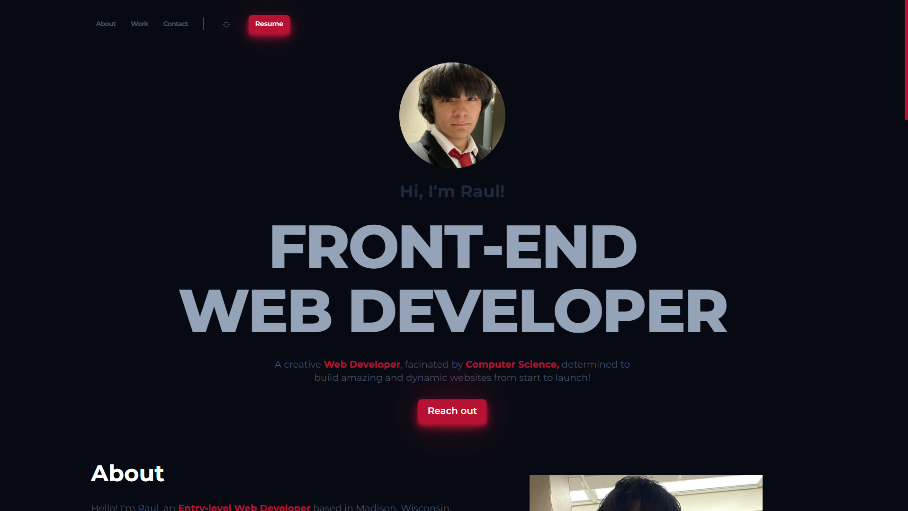
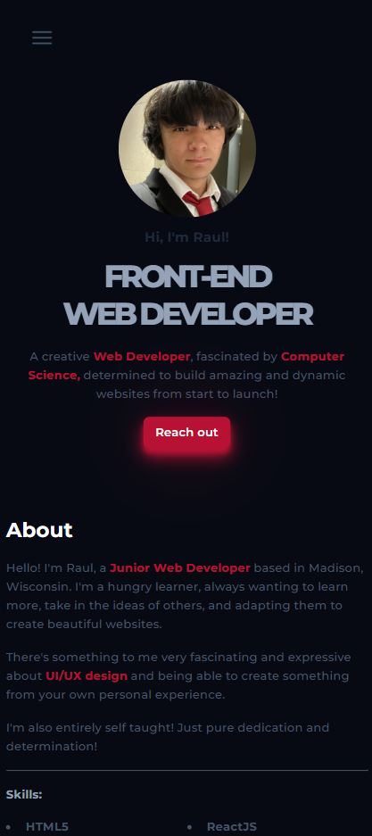

# Personal Portfolio:

This is my personal portfolio and my first independent Web Development project. It's the center piece to all of my projects, displaying my skills and abilities in HTML, CSS JavaScript and React!

The initial motivation behind this projects was to create something truly on my own after I believed I had achieved a high enough level understanding of web development. In which I could (for the first time), apply everything that I've learned up until this point. After picturing what I wanted to include and implement in my head, the portfolio was created then deployed.

I still modify it to this day and I will continue to add everything I've learned on my web development journey!

## Project Structure:

### HTML:
- `index.html`: The main file of the project that contains the user interface and markup

### CSS:
- `style.css`: All of the significant styles are located here! Including the font imported, CSS variables (including colors and font sizes), as well as many common classes used throughout the project!
### Other CSS documents (All style their corresponding HTML section!):
- `header.css`
- `utils.css`
- `hero.css`
- `about.css`
- `work.css`
- `contact.css`
- `footer.css`
- `mobile-nav.css`: Mobile navigation displayed if the media query requires it.

### JavaScript:
- `main.js`: Toggle for the mobile menu display.
- `dark-mode.js`: Adds the `.light-mode` class to the body and changing CSS variables.
- `animations.js`: Provides animations throughout the project, such as the Scatter-and-gather effect for the `#hero-title`, as well as loading in images once they come into the users view using lazy loading and the OBSERVER constant.

## Functionality

- Theme toggle.
- Desktop and mobile menu.
- Links to GitHub, send an Email and LinkedIn.
- The website is fully responsive and adapts to different screen sizes!

## Responsiveness: 

### iPad:

### iPhone / Mobile Devices:

